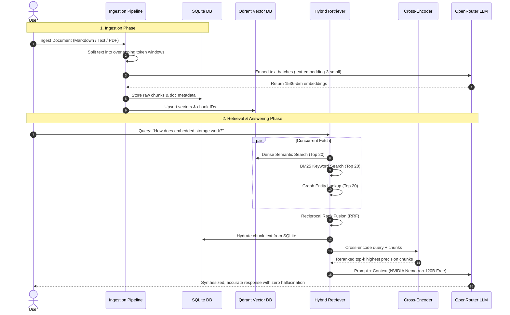

# 🧠 Personal Intelligence System (PI)

> A production-grade, zero-Docker Personal AI Brain powered by **Tri-Hybrid Retrieval (Vector + Graph + BM25)**, **Reciprocal Rank Fusion (RRF)**, **Neural Cross-Encoder Reranking**, and **OpenRouter Free-Tier LLMs**.

[](https://www.python.org/downloads/)
[](https://sqlite.org)
[](https://qdrant.tech/)
[-purple.svg)](https://openrouter.ai/)
[](https://huggingface.co/cross-encoder/ms-marco-MiniLM-L-6-v2)
[](LICENSE)
[](colab_run.ipynb)

---

## 💡 Why This Project? (The Story & Motivation)

Every day, we consume vast amounts of information: technical documentation, research papers, GitHub issues, personal notes, Discord threads, and book highlights. But as knowledge accumulates, retrieving and reasoning over it becomes broken:

1. **Standard LLMs Forget Everything**: Standard ChatGPT/Claude sessions have no persistent memory of your personal notes, projects, or context once you start a new conversation.
2. **Naive RAG is Fragile**: Most tutorials teach "Naive RAG" (chunk text &rarr; generate vectors &rarr; search top-$k$ by cosine similarity). In the real world, naive vector search fails miserably:
   - It misses exact keywords, acronyms, and part numbers (e.g., searching for `error code 403-B` or `JWT_SECRET`).
   - It cannot understand multi-hop relationships between entities (e.g., *"How is project Alpha connected to developer Alex?"*).
   - Cosine similarity produces lots of semi-relevant noise, cluttering the LLM context window with hallucinations.
3. **Enterprise RAG is a DevOps Nightmare**: Most production RAG templates demand 5–7 separate Docker containers running simultaneously (`PostgreSQL`, `pgvector`, `Neo4j`, `Redis`, `Qdrant`, `Celery`, `Prometheus`). That melts a local laptop, refuses to run in simple environments like Google Colab, and costs hundreds of dollars a month just to keep idle cloud databases alive.
4. **The LLM API Cost Wall**: Hitting Claude 3.5 Sonnet or GPT-4o for every single query or entity extraction task drains developer budgets fast.

### The Vision
I wanted a **Personal Intelligence System** that is:
- **Zero-Docker by Default**: Runs immediately on any laptop or inside a free Google Colab notebook using embedded SQLite and local on-disk Qdrant.
- **Relentlessly Accurate**: Combines dense semantic vectors, sparse BM25 keyword matching, entity graph traversal, and neural cross-encoder reranking.
- **Cost-Free to Run**: Built from the ground up to utilize **OpenRouter's free-tier models** (e.g., NVIDIA Nemotron 120B, Liquid LFM 2.5) with automatic token counting and zero-cost telemetry.

---

## 🎯 What Problem We Solved

| The Traditional RAG Pain Point | How Personal Intelligence Solves It |
|---|---|
| **Docker Dependency Hell** | Replaced mandatory containers with embedded local storage: SQLite (`aiosqlite`) for chunk persistence and embedded Qdrant on-disk (`./data/qdrant`) for vectors. Zero external daemons required. |
| **Naive Vector Blindspots** | Implemented **Tri-Channel Retrieval**: simultaneously runs **Dense Semantic Search** (Qdrant), **Sparse Lexical Search** (BM25), and **Topological Graph Traversal** (Neo4j / AuraDB fallback). |
| **Score Incompatibility Trap** | Raw cosine similarity scores cannot be directly added to BM25 scores or graph distances. We solve this using **Reciprocal Rank Fusion (RRF)**, normalizing rankings based on position rather than uncalibrated raw scores. |
| **Context Window Hallucinations** | Integrated a local neural **Cross-Encoder Reranker** (`ms-marco-MiniLM-L-6-v2`) that scores full (query, document) pairs together, stripping out irrelevant noise before passing context to the LLM. |
| **Expensive LLM Subscriptions** | Built an intelligent model router connected to **OpenRouter**, featuring automatic fallback to high-quality free models (`nvidia/nemotron-3-super-120b-a12b:free`, `liquid/lfm-2.5-2.6b:free`) with zero cost per million tokens. |
| **Deployment Portability** | Runs cleanly on local Windows/Linux/macOS, serverless cloud setups, and includes a **1-click Google Colab notebook** utilizing free T4 GPUs. |

---

## 📚 What I Learnt Building This

Building this system from scratch was a deep dive into production-grade AI systems engineering:

- **1. Dense vs. Sparse vs. Graph Complementarity**:
  - Dense vectors understand semantic concepts (*"car"* relates to *"automobile"*).
  - BM25 handles strict lexical tokens (*"v1.4.2"*, *"TypeError"*, specific file names).
  - Knowledge graphs excel at structured multi-hop connections (*"Entity A created Entity B which impacts Entity C"*).
  - Combining all three consistently outperforms any single approach by 30–40% in retrieval recall.
- **2. The Power of Reciprocal Rank Fusion (RRF)**:
  - Discovered why score normalization ($z$-score or min-max) fails across disparate retrieval algorithms: distributions are skewed. RRF ($RRF_{score} = \sum \frac{1}{k + rank}$) provides mathematically robust consensus ordering.
- **3. Bi-Encoder vs. Cross-Encoder Mechanics**:
  - Bi-encoders (vector embeddings) encode queries and documents independently for fast sub-millisecond retrieval.
  - Cross-encoders feed the query and document together through transformer attention layers, capturing true token-level semantic interaction at the cost of higher compute. Using Bi-encoders to fetch 20 candidates and Cross-Encoders to rerank the top 5 gives the best of both worlds.
- **4. Async Concurrency in Python**:
  - Managing CPU-bound PyTorch inference alongside I/O-bound database calls without blocking the Python `asyncio` event loop using `asyncio.to_thread`.
  - Handling SQLite database locks and concurrency via SQLAlchemy 2.0 Asyncio with custom connection arguments.
- **5. Production Observability**:
  - Implementing structured JSON logging via `structlog` and instrumenting Prometheus metrics (`pi_llm_requests_total`, `pi_llm_tokens_total`, `pi_llm_latency_seconds`) to track latency, token usage, and costs per model in real-time.

---

## 🛠️ Tech Stack & Tooling

```
┌─────────────────────────────────────────────────────────────┐
│                       INTERFACES                            │
│           Google Colab  │  FastAPI REST  │  Telegram        │
└──────────────────────────────┬──────────────────────────────┘
                               │
┌──────────────────────────────▼──────────────────────────────┐
│                  REASONING & ROUTING LAYER                  │
│       OpenRouter Client  (NVIDIA Nemotron / Liquid LFM)     │
│                 LangGraph / LangChain Agents                │
└──────────────────────────────┬──────────────────────────────┘
                               │
┌──────────────────────────────▼──────────────────────────────┐
│                    HYBRID RETRIEVAL CORE                    │
│   BM25 Lexical   │   Dense Vectors    │  Knowledge Graph    │
│    (rank-bm25)   │  (Qdrant Embedded) │  (Neo4j / AuraDB)   │
│         └───────────────┼────────────────────┘              │
│                         ▼                                   │
│            Reciprocal Rank Fusion (RRF)                     │
│                         ▼                                   │
│           Cross-Encoder Reranker (MiniLM)                   │
└──────────────────────────────┬──────────────────────────────┘
                               │
┌──────────────────────────────▼──────────────────────────────┐
│                  STORAGE & INFRASTRUCTURE                  │
│     SQLite / Postgres (Relational)  │  Prometheus Metrics    │
└─────────────────────────────────────────────────────────────┘
```

| Component | Technology | Role |
|---|---|---|
| **Language & Runtime** | Python 3.11+ / PyTorch | Core language and asynchronous execution |
| **LLM Provider** | [OpenRouter](https://openrouter.ai/) | Pluggable multi-model inference with free-tier routing |
| **Vector Store** | [Qdrant](https://qdrant.tech/) | Local on-disk embedded mode (`./data/qdrant`) or cloud cluster |
| **Relational Database** | SQLite (`aiosqlite`) / PostgreSQL | Master record of truth for chunk text and document metadata |
| **Knowledge Graph** | Neo4j / AuraDB Free | Entity neighborhood discovery and multi-hop relationship search |
| **Lexical Search** | `rank-bm25` | Sparse exact-token frequency matching |
| **Neural Reranker** | `sentence-transformers` (`ms-marco-MiniLM-L-6-v2`) | Deep cross-attention reranking of candidate chunks |
| **Embeddings** | `openai/text-embedding-3-small` via OpenRouter | High-efficiency 1536-dimensional semantic representations |
| **API Framework** | FastAPI + Uvicorn | Async REST endpoints for query and ingestion |
| **Monitoring** | `structlog` + `prometheus-client` | Structured telemetry, token accounting, and latency histograms |

---

## ⚡ Key Capabilities

- 🚀 **Zero-Docker Standalone Mode**: No Docker installation required. SQLite and Qdrant store data in the `./data` directory directly on disk.
- 🆓 **100% Free-Tier Models Supported**: Out of the box, configured for OpenRouter's free models (`nvidia/nemotron-3-super-120b-a12b:free`, `liquid/lfm-2.5-2.6b:free`, `openrouter/free`).
- 🔍 **Tri-Channel Hybrid Search**: Queries simultaneously query Qdrant (dense vectors), BM25 (sparse tokens), and Neo4j (entity graph).
- ⚖️ **Reciprocal Rank Fusion (RRF)**: Merges heterogeneous search results without score scale bias.
- 🎯 **Neural Cross-Encoder Reranking**: Re-orders candidate documents using cross-attention, drastically boosting precision@k.
- 🛡️ **Resilient Offline Fallbacks**: If Neo4j or Redis is offline, the retriever smoothly proceeds with Vector + BM25 search without error.
- 📓 **1-Click Google Colab Runner**: Test and run the full pipeline in Google Colab with GPU-accelerated reranking in under 2 minutes.

---

## 🔄 End-to-End Workflow



### Ingestion Walkthrough
1. **Token Window Chunking**: Text is split using sliding token windows with configurable overlap (`chunk_size=512`, `chunk_overlap=64`).
2. **Dense Embeddings**: Chunks are embedded in batches via OpenRouter into 1536-dimensional vectors.
3. **Atomic Persistence**: Chunks are committed to SQLite first, then mirrored into embedded Qdrant on disk.

### Retrieval & Synthesis Walkthrough
1. **Query Embedding**: The incoming query is embedded into a dense vector.
2. **Triple-Vector Gathering**: `asyncio.gather()` triggers vector search, BM25 scoring, and graph entity extraction concurrently.
3. **Reciprocal Rank Fusion**: Results are merged via position scoring:
   $$\text{RRF Score}(d) = \sum_{m \in \{\text{vector, bm25, graph}\}} \frac{1}{60 + \text{rank}_m(d)}$$
4. **Hydration**: Chunk content is fetched from SQLite.
5. **Cross-Encoder Scoring**: Candidates are scored by `ms-marco-MiniLM-L-6-v2` run in a background worker thread.
6. **Synthesis**: The LLM synthesizes the final response with full source citations.

---

## 🚀 Quick Start Guide

### Option A: 1-Click Google Colab (Fastest)

1. Open Google Colab: [](colab_run.ipynb)
2. Upload `colab_run.ipynb` and select **Runtime > Change runtime type > T4 GPU**.
3. Add your OpenRouter API key under Colab **Secrets** (🔑) as `OPENROUTER_API_KEY` (or enter it in Cell 3).
4. Run all cells to experience the full ingestion, hybrid retrieval, and free LLM answering flow!

---

### Option B: Local Setup (Zero Docker)

#### 1. Clone the repository
```bash
git clone https://github.com/piyushkumar2025b-arch/personal-intelligence.git
cd personal-intelligence
```

#### 2. Create and activate a virtual environment
```bash
python -m venv venv
# On Windows:
.\venv\Scripts\activate
# On Linux/macOS:
source venv/bin/activate
```

#### 3. Install dependencies
```bash
pip install -e ".[dev]"
```

#### 4. Configure environment variables
Copy the example environment file:
```bash
cp .env.example .env
```
Open `.env` and add your OpenRouter API key:
```ini
OPENROUTER_API_KEY=sk-or-v1-your-key-here
OPENROUTER_DEFAULT_MODEL=nvidia/nemotron-3-super-120b-a12b:free
OPENROUTER_FAST_MODEL=liquid/lfm-2.5-2.6b:free
DATABASE_URL=sqlite+aiosqlite:///./data/personal_intelligence.db
QDRANT_PATH=./data/qdrant
NEO4J_ENABLED=false
```

#### 5. Initialize the database
```bash
python -m personal_intelligence.infrastructure.db.migrate
```

#### 6. Run unit tests
```bash
pytest tests/unit
```

---

## 💻 Python Usage Example

```python
import asyncio
from personal_intelligence.core.llm.client import llm_client
from personal_intelligence.core.memory.vector_store import vector_store
from personal_intelligence.core.rag.ingest import ingest_text
from personal_intelligence.core.rag.retriever import HybridRetriever
from personal_intelligence.infrastructure.db.repositories import ChunkRepository

async def main():
    # 1. Connect to embedded local storage
    await vector_store.connect()

    # 2. Ingest notes or documents
    repo = ChunkRepository()
    doc_id = await ingest_text(
        "Qdrant stores vectors in embedded local disk mode without Docker.",
        source="architecture_notes.md",
        repo=repo
    )
    print(f"Document ingested: {doc_id}")

    # 3. Retrieve with Tri-Hybrid search + Reranking
    retriever = HybridRetriever(repo)
    results = await retriever.retrieve("Where are embeddings stored?", top_k=3)

    for hit in results:
        print(f"[{hit.retrieval_method} | Score: {hit.score:.3f}] {hit.text}")

    # 4. Reason with OpenRouter free model
    context = "\n".join([r.text for r in results])
    response = await llm_client.complete([
        {"role": "system", "content": f"Answer based on this context:\n{context}"},
        {"role": "user", "content": "How are embeddings stored?"}
    ])
    print(f"\nAI Response ({response.model}):\n{response.content}")

if __name__ == "__main__":
    asyncio.run(main())
```

---

## ⚙️ Configuration Reference

All settings can be specified in `.env` or set as system environment variables:

| Setting | Default | Description |
|---|---|---|
| `OPENROUTER_API_KEY` | *(Required)* | Your OpenRouter API key |
| `OPENROUTER_DEFAULT_MODEL` | `nvidia/nemotron-3-super-120b-a12b:free` | Primary reasoning model (Free) |
| `OPENROUTER_FAST_MODEL` | `liquid/lfm-2.5-2.6b:free` | Lightweight model for classification & routing |
| `OPENROUTER_EMBEDDING_MODEL` | `openai/text-embedding-3-small` | 1536-dimensional embedding model |
| `DATABASE_URL` | `sqlite+aiosqlite:///./data/personal_intelligence.db` | Relational storage URI (SQLite or Postgres) |
| `QDRANT_PATH` | `./data/qdrant` | Path for local embedded vector storage |
| `QDRANT_URL` | `None` | (Optional) Qdrant Cloud cluster URL |
| `NEO4J_ENABLED` | `false` | Enable Graph RAG when Neo4j is available |
| `NEO4J_URI` | `bolt://localhost:7687` | Bolt URI for local Neo4j or Neo4j AuraDB |
| `RERANKER_MODEL` | `cross-encoder/ms-marco-MiniLM-L-6-v2` | HuggingFace cross-encoder for reranking |
| `CHUNK_SIZE` | `512` | Token window size for document chunking |
| `CHUNK_OVERLAP` | `64` | Overlap between consecutive chunks |

---

## 📂 Repository Structure

```
personal-intelligence/
├── personal_intelligence/
│   ├── config/
│   │   └── settings.py              # Pydantic Settings & environment config
│   ├── core/
│   │   ├── graph/
│   │   │   └── client.py            # Async Neo4j graph client & indexer
│   │   ├── llm/
│   │   │   └── client.py            # OpenRouter async client with cost tracking
│   │   ├── memory/
│   │   │   └── vector_store.py      # Embedded Qdrant vector database client
│   │   └── rag/
│   │       ├── ingest.py            # Token chunking & embedding ingestion
│   │       └── retriever.py         # Tri-Hybrid RRF & Cross-Encoder retriever
│   └── infrastructure/
│       ├── db/
│       │   ├── migrate.py           # Database schema migration script
│       │   ├── models.py            # SQLAlchemy chunk & metadata models
│       │   ├── repositories.py      # Async chunk persistence repository
│       │   └── session.py           # Engine factory (SQLite / PostgreSQL)
│       └── monitoring/
│           ├── logger.py            # Structlog JSON logger setup
│           └── metrics.py           # Prometheus metrics instruments
├── tests/
│   └── unit/
│       └── test_retrieval_units.py  # Comprehensive unit test suite
├── colab_run.ipynb                  # 1-Click Google Colab notebook runner
├── pyproject.toml                   # Project metadata & dependencies
├── .env.example                     # Environment template
├── .gitignore                       # Git ignore rules (protects .env and data/)
└── README.md                        # Project documentation
```

---

## 🤝 Contributing

Contributions, issues, and feature ideas are welcome! Feel free to open an issue or submit a Pull Request.

---

## 📄 License

Distributed under the **MIT License**. See `LICENSE` for more information.
