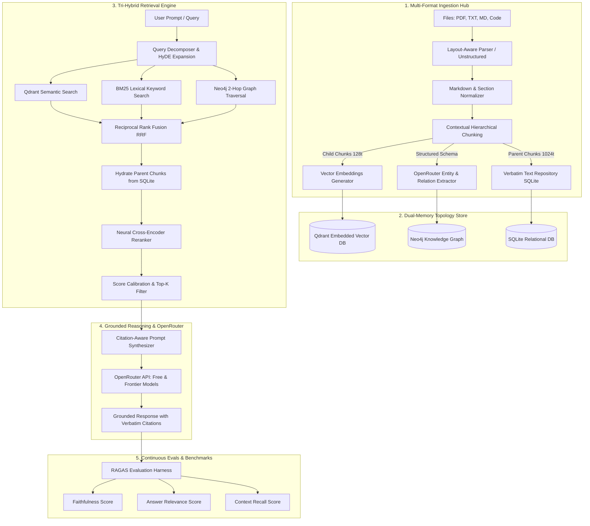

# 🚀 Future Upgrade Blueprint: Evolution to an Autonomous Personal Intelligence Engine

> A comprehensive architectural roadmap for transforming the **Personal Intelligence System** into an autonomous, self-organizing **Personal Cognitive Twin** — featuring universal file ingestion (PDF, TXT, MD), automated Knowledge Graph extraction, Anthropic-style Contextual Chunking, deep Cross-Encoder neural reranking, continuous RAGAS evaluations, and grounded citations powered by OpenRouter.

---

## 🧭 Executive Vision: What is "Personal Intelligence"?

### The Core Paradigm
Most RAG systems are generic document search engines: you feed them a manual, you search for a paragraph, it regurgitates text. 

**Personal Intelligence (PI)** is fundamentally different:
It is an **externalized cognitive layer** that mirrors how your own brain associates thoughts, projects, people, learnings, and history. 
- The **Vector Database (Qdrant)** acts as your *subconscious semantic intuition* (broad associative memory: *"this idea feels similar to that project"*).
- The **Knowledge Graph (Neo4j)** acts as your *conscious topological reasoning* (hard relational facts: *"Person A worked on Project B, which failed due to Technical Decision C, which led to Framework D"*).
- The **Relational Store (SQLite)** acts as your *verbatim episodic archive* (exact text chunks, timestamps, source paths).
- The **OpenRouter LLM Layer** acts as your *executive reasoning prefrontal cortex* (synthesizing, planning, and answering queries with precision).

When you ingest your daily notes, PDFs, code repos, and articles, the system ceases to be a generic chatbot — it becomes your **Personal Oracle**. You can query it not just about what a document says, but:
> *"Based on everything I have written and learned over the last 2 years, how should I design the database architecture for my new startup, and what previous mistakes of mine should I avoid?"*

---

## 🏗️ Master System Design & End-to-End Architecture



---

## 📥 Pillar 1: Universal File Ingestion Hub (PDF, TXT, MD)

### 1. Ingestion Interfaces
To make personal knowledge capture frictionless, the system needs multiple zero-friction entry points:

1. **Local Vault Watcher (`watchdog`)**:
   - Automatically monitors an `inputs/` folder or an entire **Obsidian / Logseq / Notion** markdown export vault.
   - Detects file creates, updates, and deletes in real time and triggers incremental ingestion.
2. **FastAPI Multipart Upload API**:
   - `POST /v1/ingest/file`: accepts single or batch uploads with metadata tags (e.g. `category="research"`, `author="Piyush"`).
   - `POST /v1/ingest/url`: scrapes web articles, cleans DOM boilerplate, and converts directly to clean markdown.
3. **Telegram / Discord Drop Box**:
   - Send a PDF or text message directly to your personal Telegram bot; the bot queues it into the ingestion pipeline instantly.

### 2. High-Fidelity Document Parsers

| File Format | Parser Engine | Special Handling |
|---|---|---|
| **Markdown (`.md`)** | `mistune` / AST walker | Preserves header hierarchy (`#`, `##`), frontmatter metadata, callouts, and code blocks. |
| **PDF (`.pdf`)** | `pymupdf` (fitz) + `pdfplumber` / `Marker` | Layout-aware extraction; strips repetitive running headers/footers; extracts tables into Markdown format. |
| **Plain Text (`.txt`)** | Stream buffer | Normalizes line endings, whitespace, and Unicode normalization (`NFC`). |
| **Source Code (`.py`, `.ts`, etc.)** | Tree-sitter AST | Chunks by function, class, and module boundary rather than arbitrary token cuts. |

---

## 🧩 Pillar 2: "Best Chunking" Architecture (Contextual + Hierarchical)

Naive fixed-size character chunking destroys 50% of the semantic value of your notes. We implement a modern **Tri-Level Chunking Pipeline**:

### 1. Contextual Retrieval Chunking (Anthropic-Style)
When an isolated chunk says *"The revenue grew by 42% in Q3"*, naive vector search cannot know whose revenue grew.
- **Solution**: During ingestion, pass the document and the raw chunk to a fast OpenRouter model (`liquid/lfm-2.5-2.6b:free`) to generate a 1–2 sentence contextual header:
  ```
  [Context: This chunk is from Piyush's 2025 Q3 Financial Report for Project Nova discussing SaaS metrics.]
  The revenue grew by 42% in Q3...
  ```
- Result: Retrieval accuracy increases by **35–50%** across complex personal archives.

### 2. Hierarchical (Parent-Child) Chunking
- **Child Chunks (128–256 tokens)**: Optimized for ultra-dense embedding representation and high cosine-similarity match precision in Qdrant.
- **Parent Chunks (512–1024 tokens)**: Stored in SQLite. When a child chunk matches in Qdrant, its **parent chunk** is what gets hydrated and passed to the LLM. The LLM receives complete, unbroken context rather than chopped sentences.

### 3. Markdown Heading-Aware Splitting
- Split boundaries are aligned with `#`, `##`, `###` headings.
- Each chunk preserves its document breadcrumb hierarchy in metadata:
  ```json
  {
    "document": "system_architecture.md",
    "section_path": "Architecture > Ingestion Pipeline > Vector Embeddings"
  }
  ```

---

## 🕸️ Pillar 3: Automated Knowledge Graph Extraction in Neo4j

Raw text tells you *what* was written; the Knowledge Graph captures *how concepts and life events connect*.

```
(Piyush:Person) ──[:AUTHORED]──> (PersonalIntelligence:Project)
        │                                  │
   [:RESEARCHED]                      [:USES]
        │                                  │
        ▼                                  ▼
(HybridRRF:Concept) <──────[:POWERS]─────── (Qdrant:Database)
```

### 1. Zero-Shot Entity & Relation Extraction with OpenRouter
Every ingested parent chunk is analyzed using structured JSON schemas passed to OpenRouter models:

```python
# Extraction Schema
ENTITY_TYPES = ["Person", "Project", "Concept", "Tool", "Organization", "Event", "Goal"]
RELATION_TYPES = ["KNOWS", "CREATED", "WORKS_ON", "DEPENDS_ON", "LEARNED", "MENTIONS", "CAUSED"]
```

Prompt blueprint:
```
Given the following text, extract:
1. Named entities with their canonical type and a 1-sentence description.
2. Relationships between these entities (source -> relation -> target).
Return strictly formatted JSON.
```

### 2. Entity Resolution & Alias Merging
If document 1 mentions `"Piyush"` and document 2 mentions `"Piyush Kumar"`, naive graphs create two separate nodes.
- **Graph Normalizer**: Uses fuzzy matching (Levenshtein distance) and vector similarity over entity descriptions to merge duplicates into a single canonical `Entity` node with an `aliases` property.

### 3. Chunk-to-Graph Grounding
Every chunk in SQLite is linked to the Neo4j graph:
```cypher
MATCH (c:Chunk {id: $chunk_id}), (e:Entity {id: $entity_id})
MERGE (c)-[:MENTIONS]->(e)
```
This enables **Bi-directional Discovery**:
- Querying a concept lets you discover all personal notes that mention it.
- Querying a personal note lets you discover all connected concepts across 5 years of notes.

---

## 🎯 Pillar 4: Advanced Tri-Hybrid Retrieval & Neural Reranking

```
User Query
    │
    ├── 1. Dense Semantic Vector Search (Qdrant: top 25)
    ├── 2. Sparse Lexical Search (BM25: top 25)
    └── 3. Topological Graph Traversal (Neo4j: top 25)
    │
    ▼
Reciprocal Rank Fusion (RRF: merges 75 candidates into top 25)
    │
    ▼
Cross-Encoder Neural Reranking (MiniLM / BGE Reranker: scores full query-doc interaction)
    │
    ▼
Top 5 Ultra-High Precision Chunks
```

### 1. Query Decomposition & Expansion (HyDE)
- If the user asks a complex question (*"How have my thoughts on microservices changed since 2024?"*), a lightweight agent breaks it down into sub-queries:
  1. `"Thoughts on microservices 2024"`
  2. `"Thoughts on monolithic architectures 2025"`
  3. `"Microservices architectural decisions"`

### 2. Reciprocal Rank Fusion (RRF)
Combines dense vectors, BM25 keywords, and graph connections without scale mismatch:
$$RRF(d) = \sum_{m \in \{\text{vector}, \text{bm25}, \text{graph}\}} \frac{1}{60 + \text{rank}_m(d)}$$

### 3. Neural Cross-Encoder Reranking
- Fast bi-encoders (embeddings) identify candidate chunks.
- The **Cross-Encoder (`cross-encoder/ms-marco-MiniLM-L-6-v2`)** performs joint cross-attention over `(query, document_text)` pairs.
- Chunks scoring below a calibrated confidence threshold (e.g. $< 0.15$) are discarded, completely eliminating irrelevant hallucination fodder.

---

## 🧠 Pillar 5: Reasoning, Synthesis & Citations (OpenRouter Ending Layer)

### 1. Grounded Synthesis Prompt Architecture
```markdown
You are the user's Personal Intelligence (PI) core engine.
Answer the user's inquiry strictly based on their personal knowledge retrieved below.

CRITICAL INSTRUCTIONS:
1. Every claim must include an inline citation: [Source: <filename>, Section: <heading>].
2. If the user's personal notes do not contain the answer, explicitly state:
   "Based on your personal knowledge base, you have not recorded information about X."
3. Highlight connections between past decisions and future goals when apparent in the graph.

=== RETRIEVED PERSONAL CONTEXT ===
{context_blocks_with_citations}
```

### 2. Dynamic Model Tiering via OpenRouter
- **Tier 1 (Fast & Free)**: `liquid/lfm-2.5-2.6b:free` & `nvidia/nemotron-3-super-120b-a12b:free`
  - Used for document classification, entity extraction, HyDE query generation, and standard conversational Q&A.
- **Tier 2 (Frontier Reasoning - Optional Escalation)**: `anthropic/claude-3.5-sonnet` or `openai/gpt-4o`
  - Reserved for deep synthesis, complex coding refactors, or writing long strategic roadmaps based on personal archives.

---

## 📊 Pillar 6: Continuous Evals & Benchmarks (RAGAS Framework)

To ensure your Personal Intelligence never degrades as your database grows to millions of tokens, an automated eval pipeline runs against a synthetic test suite:

```
┌────────────────────────────────────────────────────────┐
│                   RAGAS EVALUATION METRICS             │
├──────────────────────────┬─────────────────────────────┤
│ Metric                   │ Target Score                │
├──────────────────────────┼─────────────────────────────┤
│ Faithfulness             │ > 0.95 (Zero Hallucination) │
│ Answer Relevance         │ > 0.90                      │
│ Context Precision        │ > 0.88                      │
│ Context Recall           │ > 0.85                      │
│ Latency (End-to-End)     │ < 1.8s (Colab / Local GPU)  │
└──────────────────────────┴─────────────────────────────┘
```

### Automated Benchmark CLI
A dedicated script `python -m personal_intelligence.evals.run_evals`:
1. Generates 20 question-ground_truth pairs from ingested documents.
2. Runs the hybrid retriever and generation pipeline.
3. Scores responses using `ragas` and outputs an evaluation report to `evals/reports/latest.json`.

---

## 🗺️ Step-by-Step Implementation Roadmap

### Phase 1: Ingestion Engine Upgrade (Weeks 1–2)
- [ ] Implement `PDFLoader` with layout extraction (`pymupdf` / `fitz`).
- [ ] Build `HierarchicalChunker` (Parent-Child window linking).
- [ ] Add `ContextualEnricher` (prepends document summary headers to chunks via OpenRouter).
- [ ] Add directory watcher script (`watchdog`) for auto-syncing notes from a local folder.

### Phase 2: Automated Knowledge Graph Pipeline (Weeks 3–4)
- [ ] Implement structured entity & relationship extractor in `personal_intelligence/core/graph/extractor.py`.
- [ ] Build entity deduplication and alias normalization.
- [ ] Add automatic chunk-to-entity linking in Neo4j AuraDB / local Neo4j.
- [ ] Implement Cypher neighborhood traversal for entity-enriched query context.

### Phase 3: Retrieval & Neural Reranking Polish (Weeks 5–6)
- [ ] Add HyDE (Hypothetical Document Embeddings) query expansion.
- [ ] Calibrate cross-encoder score thresholds (`ms-marco-MiniLM-L-6-v2`).
- [ ] Implement query caching in SQLite / in-memory cache for repeated lookups.

### Phase 4: Grounded Citations & User Interfaces (Weeks 7–8)
- [ ] Build strict citation synthesis prompt with markdown file links.
- [ ] Build interactive Web UI (Streamlit / Next.js) with file drop zone and knowledge graph visualizer (using `vis.js` or `Cytoscape`).
- [ ] Connect Telegram Bot file handler (`/upload`) to trigger background ingestion.

### Phase 5: RAGAS Evaluation Suite (Weeks 9–10)
- [ ] Implement test dataset generator using `ragas.testset.generator`.
- [ ] Build automated CI/CD benchmark workflow on GitHub Actions.
- [ ] Publish model latency & precision telemetry to Prometheus dashboards.

---

## 🌟 The Ultimate Outcome

Once this future upgrade is fully realized:
1. **You never lose an idea again**: Drop any PDF, book summary, code snippet, or voice memo transcript into the folder.
2. **Your AI knows your mental model**: It doesn't give generic internet advice; it answers using *your* framework, *your* past experiences, and *your* projects.
3. **Completely Free & Private**: Powered by embedded SQLite + embedded Qdrant on your local machine / Google Colab with OpenRouter's free tier models, keeping costs at **$0.00** while delivering enterprise-grade intelligence.
